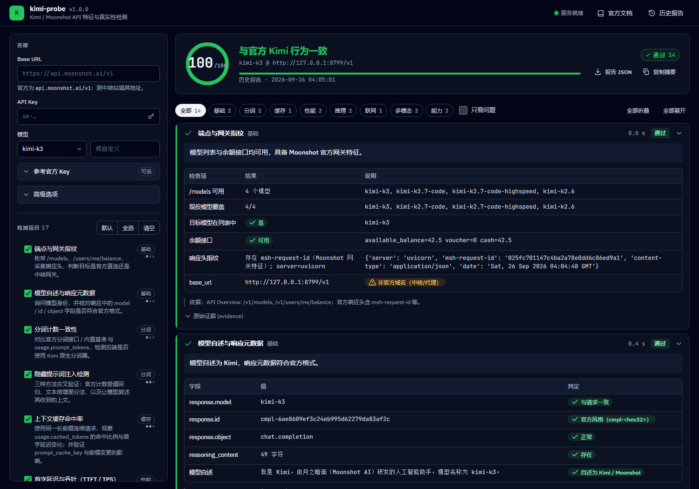

# kimi-probe

Kimi（Moonshot AI）API 特征与真实性检测套件。一个本地 Web 界面 + 17 个探针，用来回答一个问题：

> 这个 `base_url` 背后到底是不是官方 Kimi？有没有被降级、注入提示词、伪造 usage、剥离能力？

适用于：官方 Key 自检、中转 / 代理 / 聚合网关鉴定、不同模型（`kimi-k3` / `kimi-k2.7-code` / `kimi-k2.6`）能力对比。



## 检测项目

所有探针的判定依据均来自 [Kimi 官方文档](https://platform.kimi.ai/docs)，界面中每张结果卡片底部都标注了对应的文档依据。

| 分类 | 探针 | 检测内容 | 关键信号 |
| --- | --- | --- | --- |
| 基础 | 端点与网关指纹 | `/models`、`/users/me/balance`、响应头 | `msh-request-id`、`x-ratelimit-*`、退役模型仍在列表 |
| 基础 | 模型自述与响应元数据 | 身份问答、`id` / `model` / `object` 格式 | 自述为其他厂商、`id` 非 `cmpl-<hex>` |
| 分词 | 分词计数一致性 | 官方 tokenizer / 内置基准 vs `usage.prompt_tokens` | 偏差 > 2% 即非 Kimi 原生分词器 |
| 分词 | 隐藏提示词注入 | ① 官方计数差值线性回归 ② 文本倍增差分法 ③ 行为法复述 | 差值恒定 > 0 = 固定注入；差值随长度增长 = 分词器不一致 |
| 缓存 | 上下文缓存命中率 | 同前缀多轮 `cached_tokens` 比例、TTFT 变化、前缀变更后失效 | 缺 `cached_tokens` 字段、命中率为 0、前缀变更后仍命中 |
| 性能 | TTFT / TPS | TTFB、首推理 token、首内容 token、吞吐（多轮取中位数） | 伪流式（整体生成后突发转发） |
| 性能 | 流式协议合规性 | `role` 首块、`reasoning` 先于 `content`、`[DONE]`、`include_usage` 末尾块、单一 `id` | 多 `id` 拼接、`model` 不一致 |
| 推理 | 思考模式 | `reasoning_content` 是否返回；K3 `reasoning_effort`、K2.6 `thinking.type`、K2.7 恒开；Preserved Thinking 回传 | 缺推理内容、非法配置未报错 |
| 推理 | 固定参数约束 | `temperature=0.2` / `top_p=0.5` / `n=2` / `presence_penalty` / 退役模型名 / K2.x `tool_choice=required` | 官方一律 400 `invalid_request_error`，中转清洗参数后不报错 |
| 联网 | `$web_search` 内置工具 | `builtin_function` 是否被接受、是否发起 `tool_calls`、`arguments.usage.total_tokens`、回答时效性 | 从不发起搜索、缺官方特有 usage 字段 |
| 联网 | 独立搜索接口（可选） | `POST /v1/tools/search` | 中转通常不转发 |
| 多模态 | 图像理解 | 运行时生成随机验证码图片（base64），逐字识别；官方分词接口核对图片 token | `prompt_tokens` 过低 = 图片被丢弃 |
| 多模态 | 视频理解 | 逐帧不同数字的动画 GIF（平台按视频解码）；可选 `/files` 上传 + `ms://` 引用 | 只识别单帧 = 被降级为静态图 |
| 能力 | 函数调用 | 流式 `tool_calls` 分片拼接、参数合法性、结果回传后引用 | |
| 能力 | 结构化输出 & Partial Mode | `json_schema strict`、`json_object`、`partial=true` 续写 | |
| 能力 | 长上下文召回（可选） | 大海捞针，可配 8K～200K tokens | 截断、窗口不足 |
| 能力 | Anthropic 协议（可选） | `/anthropic/v1/messages` | |

综合判定：`identity` / `tokenizer` / `hidden_prompt` / `params` / `thinking` / `streaming` 任一失败 → **疑似非官方 / 被篡改**。

## 快速开始

```bash
git clone https://github.com/jkjk02/kimi-probe.git
cd kimi-probe
pip install -r requirements.txt
python run.py
```

打开 http://127.0.0.1:8765 ，填入 Base URL、API Key，选择模型和探针，点击「开始检测」。结果通过 SSE 实时推送，完整报告 JSON 保存在 `reports/`。

环境变量：`KIMI_PROBE_HOST`（默认 `127.0.0.1`）、`KIMI_PROBE_PORT`（默认 `8765`）。

### 测试中转站时

中转通常不转发 `/v1/tokenizers/estimate-token-count`，分词与隐藏提示词探针会失去官方对照。两种解决办法：

1. 在「参考官方 Key」中填一个官方平台 Key。它**只用于分词接口**，不消耗推理额度。
2. 用官方 Key 生成一次基准文件，之后离线可用：

```bash
set MOONSHOT_API_KEY=sk-...
python tools/build_baseline.py --model kimi-k3
```

生成的 `baselines/kimi-k3.json` 会被自动加载。

### 不花钱先看效果

仓库自带一个模拟官方行为的 mock 服务，以及一个模拟“劣质中转”的模式：

```bash
python tools/mock_server.py --port 8799 --mode official
python tools/mock_server.py --port 8798 --mode relay
```

把 Base URL 填成 `http://127.0.0.1:8799/v1`（任意 Key）即可看到全绿；填 `8798` 则能看到隐藏提示词、伪流式、缺 `cached_tokens`、参数未校验等问题被逐项标出。

## Token 消耗

默认探针集合一次运行约 3 万～8 万 tokens（K3 `reasoning_effort=low`）。`$web_search` 每次调用另计 $0.005。长上下文探针默认关闭。

## 项目结构

```
server/
  app.py            FastAPI + SSE
  client.py         异步 HTTP 客户端，记录时序与响应头
  framework.py      探针注册 / 结果模型
  samples.py        内置样本文本（与基准文件一一对应）
  media.py          运行时生成验证码图片 / 动画 GIF
  probes/           17 个探针，按类别分文件
web/                纯静态前端（无构建步骤）
tools/
  build_baseline.py 用官方 Key 生成分词基准
  mock_server.py    官方 / 中转 两种模式的模拟服务
baselines/          分词基准 JSON
reports/            运行报告（已 gitignore）
```

新增探针：在 `server/probes/` 下用 `@probe(...)` 装饰一个 `async def`，返回 `ProbeResult` 即可，无需改动前端。

## 参考

- [Chat Completions API](https://platform.kimi.ai/docs/api/chat)
- [Estimate Tokens](https://platform.kimi.ai/docs/api/estimate)
- [Context Caching](https://platform.kimi.ai/docs/guide/use-context-caching-feature-of-kimi-api)
- [Thinking Models](https://platform.kimi.ai/docs/guide/use-thinking-models)
- [Model Parameter Reference](https://platform.kimi.ai/docs/api/models-overview)
- [Web Search ($web_search)](https://platform.kimi.ai/docs/guide/use-web-search)
- [Vision Models](https://platform.kimi.ai/docs/guide/use-kimi-vision-model)
- [Streaming](https://platform.kimi.ai/docs/guide/utilize-the-streaming-output-feature-of-kimi-api)
- [Common Error Codes](https://platform.kimi.ai/docs/api/errors)

## License

MIT
